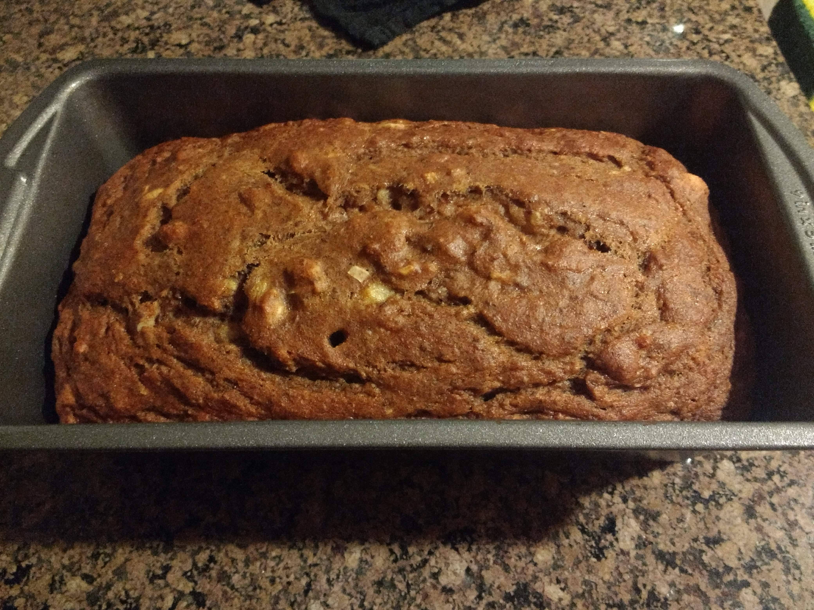
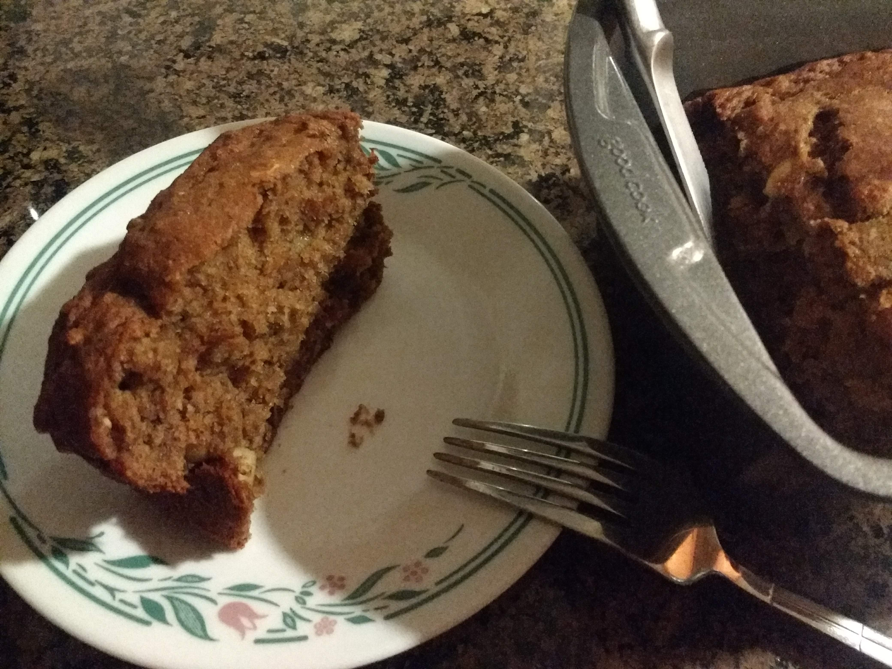

# Banana Bread

Original source: https://www.pickuplimes.com/single-post/2017/02/03/One-bowl-Moist-Chocolate-Banana-Bread

For this one, I've tried to follow the directions pretty carefully, with a few ingredient substitutions. This is another one of PUL's very simple and easy recipes, with convenient ingredients. 

## Ingredients
* 2 Tbsp (14g) ground flax seeds 
* 6 Tbsp (90mL) water 
* 3 medium ripe bananas
* 1/4 cup (60mL) vegetable oil (not olive oil) 
* 1/4 cup (60g) applesauce 
* 1/2 cup (100g) sugar 
* 1 tsp (5g) baking soda
* 1/2 tsp (2.5g) baking powder
* 1/2 tsp (2.5g) salt 
* 1 tsp (5mL) pure vanilla extract 
* 1 tsp (5g) ground cinnamon
* 1 3/4 cup (280g) all-purpose plain flour (*modified: I used whole wheat flour*)
* 1/2 cup (90g) dairy-free dark chocolate, coarsely chopped (*replaced this with chooped cashews and walnuts, but only because I didn't have chocolate on hand*)

## Steps
1. In a large bowl, mix together the flax seeds and water. Let it sit for 5 minutes until it gels, mixing once halfway through.
2. Preheat the oven to 320F/160C and lightly grease a 9 x 5” (23 x 13cm) or 12 x 5" (30 x 13cm) loaf pan. 
3. Once the flax seeds have gelled, add the bananas to the bowl and mash well. Then add the oil, applesauce and sugar and mix until well combined. 
4. One by one, add the baking soda, baking powder and salt, stirring after each addition. Then add the vanilla extract and cinnamon and stir until well combined. (*I was out of vanilla extract, so I skipped it. Oops*) 
5. Add the flour a third at a time, gently mix until partly combined. Then add the chocolate and mix until just combined.
6. Pour into the greased pan and sprinkle on additional cinnamon and reserved chocolate chips if desired. Cook until the top is golden, the bread starts to pull away from the sides, and a toothpick comes out clean; about 50 minutes if using a 9 x 5” pan, and 40 minutes if using a 12 x 5" pan. 

## Results
Cake in pan:

Slice shot:

## Notes
* I'm still not very happy with the texture of this cake. It was a bit too wet for my liking. 
* My baking powder must be too old for this to work well. The bread rose nicely but deflated as it cooled womp womp :cry:
* Also, I'm not sure how much of an effect whole wheat flour had to do with the taste/texture; need to research this more. My guess was that it would make the bread slightly denser, but apparently that wasn't the case. 
