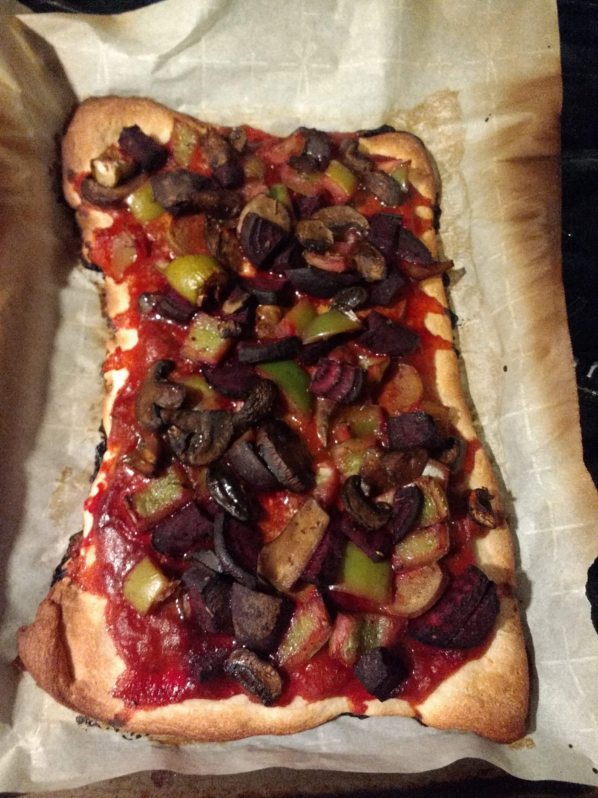
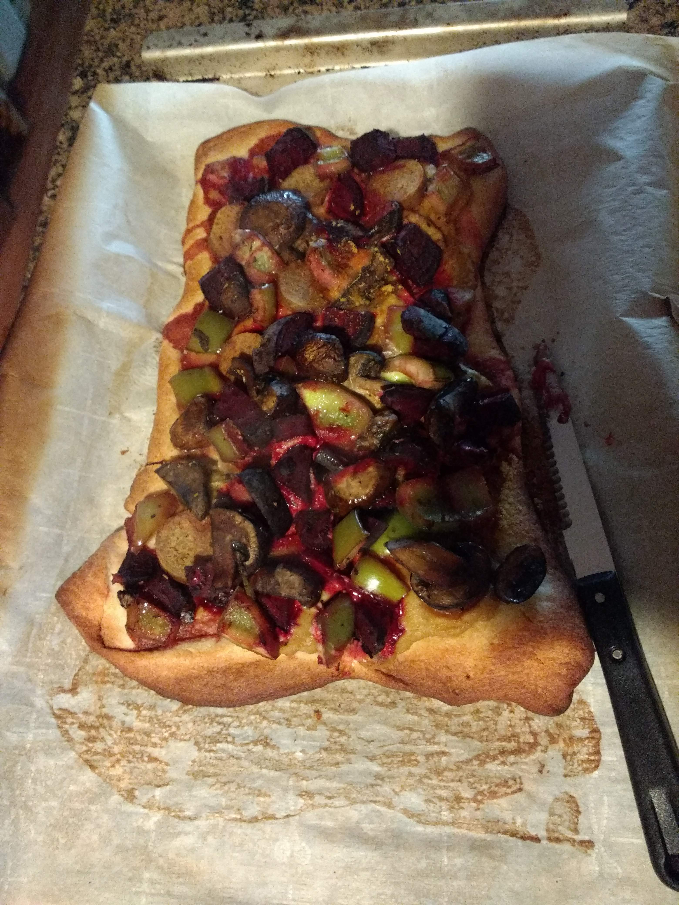

# Lazy Pizzas

Inspired by [PUL's BBQ Cauliflower Pizza](https://www.pickuplimes.com/single-post/2020/06/26/BBQ-Cauliflower-Pizza) and [Focaccia Pizza](https://www.pickuplimes.com/single-post/2018/01/18/Focaccia-Pizza-with-Tahini-Balsamic-Drizzle).
"Inspired" is a generous term; I mainly consulted these for sauce and topping ideas, and dough-baking temperature and time estimates. 
In reality I cheated in a lot of steps, hence "lazy" pizza.

## Ingredients
### Dough
I cheated. I used store-bought pizza dough. 

### Pizza sauce
* Tomato sauce (again, cheated -- I used pasta sauce). Half of a typical jar -- IDK, like 8 oz worth?
* Hummus (store-bought; I used Hope's Spicy Avocado Hummus). Also like 1/3 of the hummus container, I think. 

### Topping
Just kinda winged it and used whatever veggies I had in the fridge:
* 2 beet roots
* 1 green bell pepper
* 1 vegan sausage
* 4 oz mushrooms (I used cremini, but other varieties should work as well)
* 2 tablespoons nutritional yeast

## Steps
0. Marinate toppings: chop the beets, mushrooms, bell pepper, and sausage to topping-appropriate pieces. Add to a bowl and marinate with olive oil, oregano, salt, and pepper. Can't tell you the quantity here -- just eyeballed all of this, sorry. While this sits around, do the next steps. 
1. Preheat oven to 400F (from dough packaging instructions). 
2. Unpack the dough; this turned out to fit 2 medium baking trays, so I halved it and distributed accordingly.
3. Pre-bake the dough for 8 minutes.
4. Spread tomato sauce on one pizza, and hummus on the other. Just eyeball it and spread to your heart's (and eyes') desire. Sprinkle nutritional yeast --- I'm hoping it sticks to the sauce at this step instead of flying around/burning if I add it after the toppings.
5. Top with the toppings.
6. Reduce temp to 375F and bake for 30 minutes.

## Results
Tomato base pizza:

Hummus base pizza:

## Notes
* This turned out great!!! :heart_eyes: although I might have used a bit too much salt. I was pleasantly surprised that the beets blended in nicely, and that the lack of real cheese was barely noticeable or a problem! Will definitely do this again. The hummus was definitely a nice trick! 
* Nutritional yeast's flavor seemed to have been able to stick around, as opposed to completely disappearing (I've had this happen quite frequently, as I could no longer taste the nooch after it disappears into the ingredients).
* Crust was a bit burned, probably should have reduced the temp/time even further. I'll take it out at 20 minutes next time.
* I meant to try to incorporate the tahini-balsamic drizzle from the Focaccia Pizza recipe, but I completely forgot! And it would have added too much sodium and acidity on top of the bases I chose anyway. Next time!
* I had so much fun with this I've decided to make my own dough from scratch next time. The BBQ pizza called for self-rising flour, which I already looked up how to make at home ([source](https://www.thekitchn.com/how-to-make-self-rising-flour-232729) --- scale up accordingly): 
    * 1 cup all-purpose flour 
    * 1 1/2 teaspoons baking powder 
    * 1/4 teaspoon fine salt
