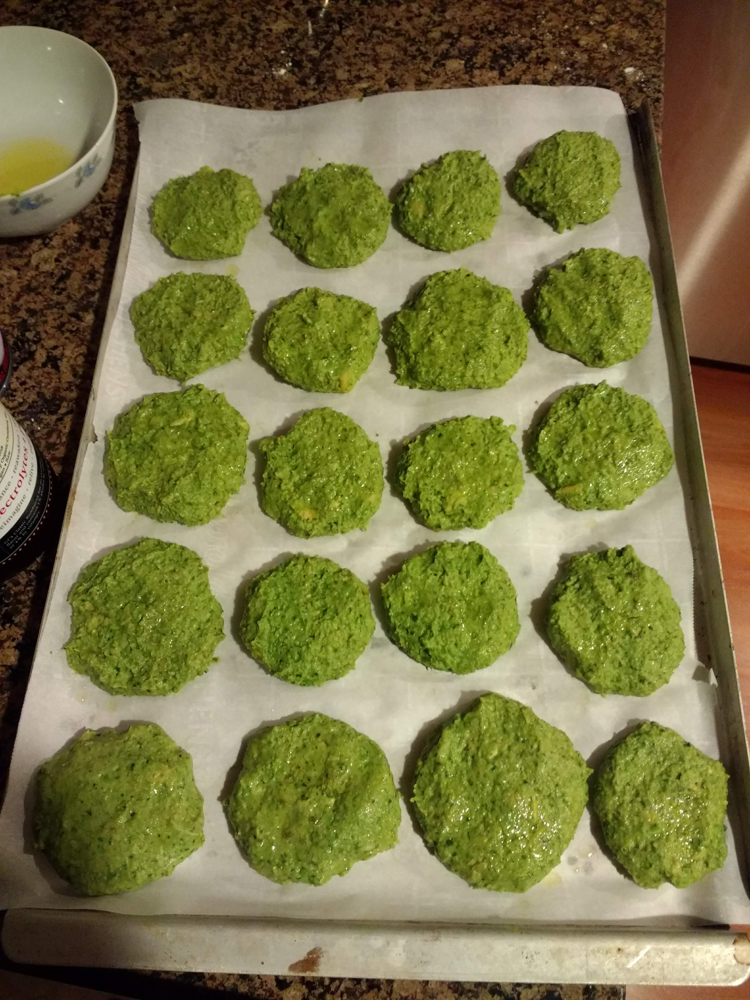
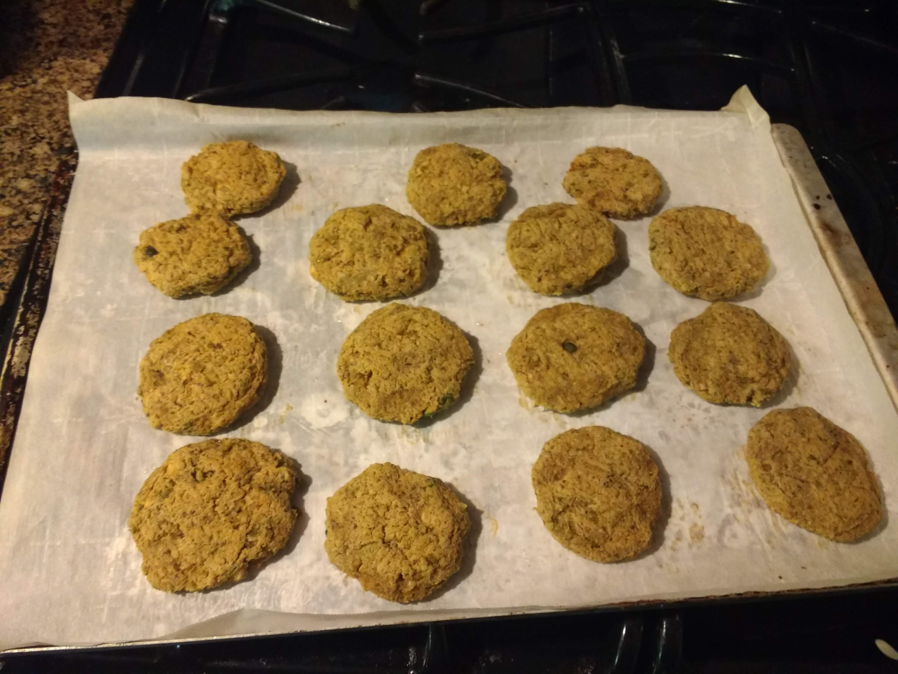
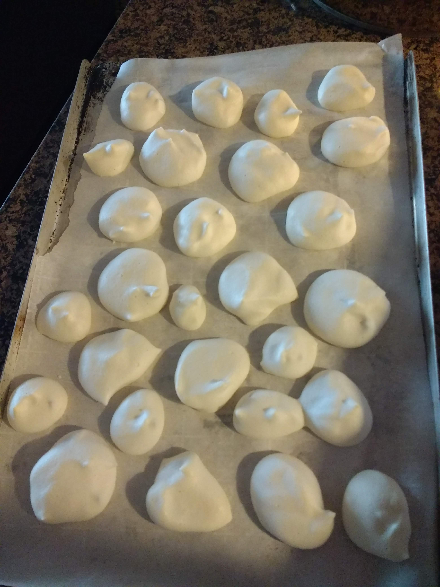
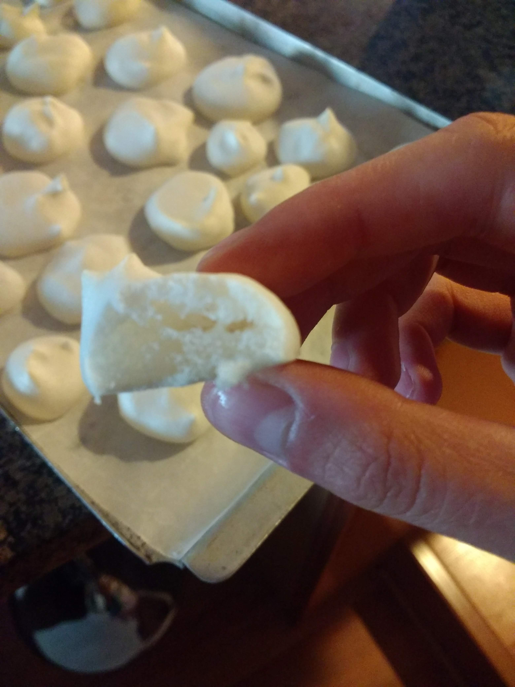
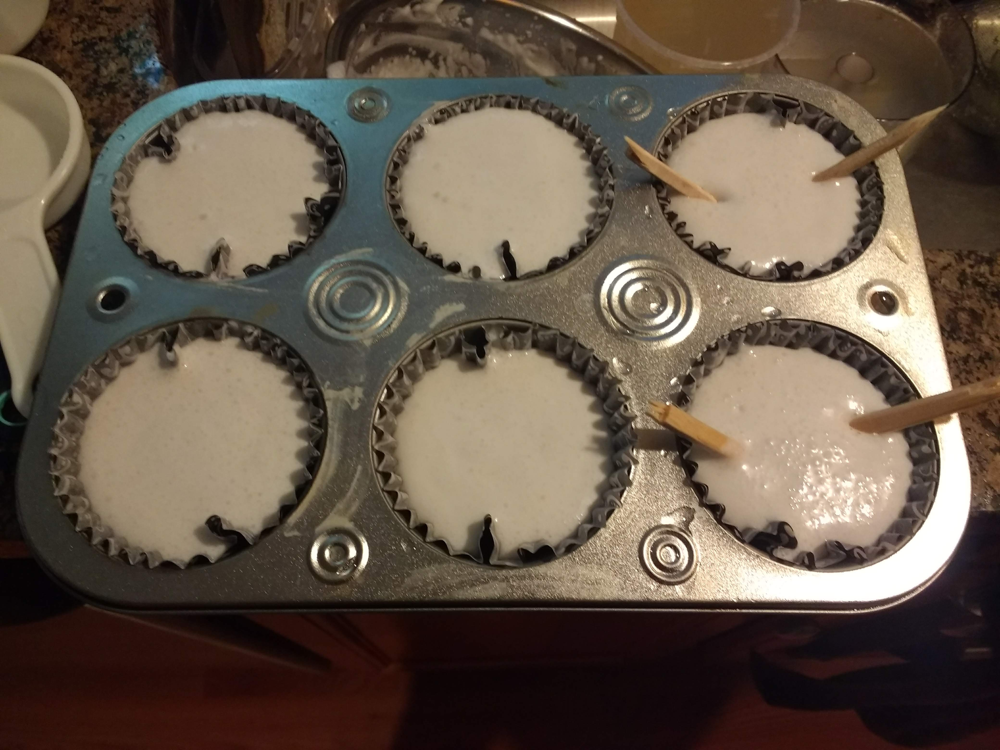
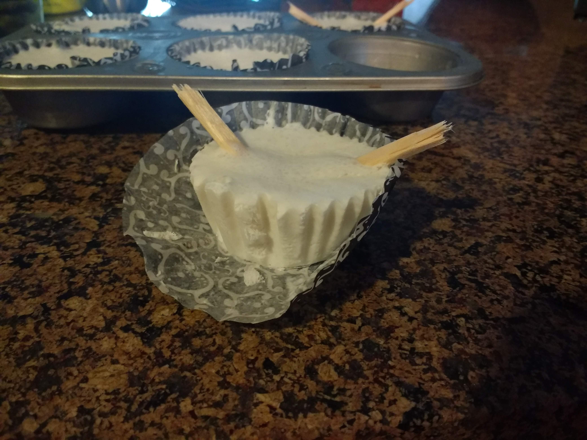

# Chickpea extravaganza

It turned out that one of my housemates has a food processor, so I've been experimenting with recipes I've always wanted to try but couldn't because of the lack of equipment.
So while I still had access to the food processor, 
I went for a [falafel](https://www.pickuplimes.com/single-post/2020/05/10/Baked-Green-Pea-Chickpea-Falafels) recipe that has been on the top of my list. 
However, as I hate wasting food (any part of it), the issue with cooking with canned chickpeas is always the leftover aquafaba, which I would rather not throw away. 
And because my [chocolate mousse](2020-07-11-chocolate-mousse.md) last time turned out horrendous, I decided to look for other options. 
[This vegan marshmallow coconut popsicle recipe](https://www.liveeatlearn.com/vegan-marshmallow-coconut-popsicles/) came up, and actually I found it as I was googling around about whether canned chickpeas are cooked (:see_no_evil:)!
After whipping it to soft peaks (before adding coconut milk), I thought it tasted more like meringue than anything else, so I thought I might as well split this batch into a meringue batch and a popsicle one. 
Quick search yielded this [meringue recipe](https://lovingitvegan.com/vegan-meringue/), so I went for it. 

## Results
Falafels:

Meringues:

Popsicles:

## Notes
* Falafels turned out pretty great! This is quite a forgiving recipe, so adding/omiting veggies by volume still worked out fine. For example, I didn't have quite enough green peas, so I threw in some leftover spinach. 
* Meringues were... meringues. They melted quite easily though! So storing them in the fridge is necessary.
* Popsicles: were a surprise success! But I guess coconut milk makes everything better so couldn't really go wrong there. 

