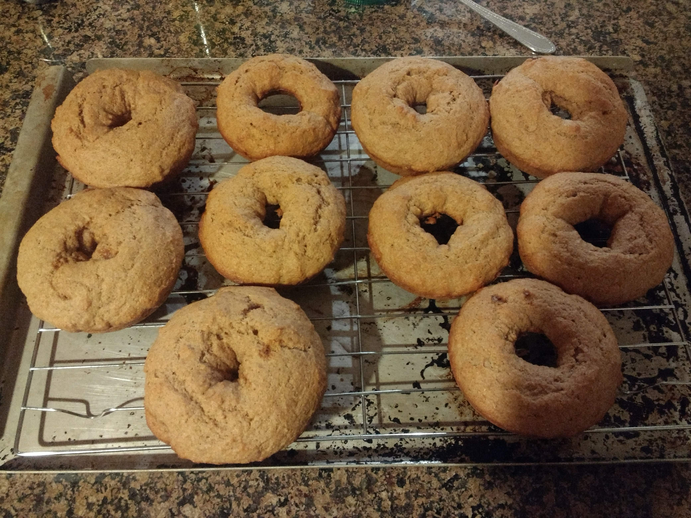
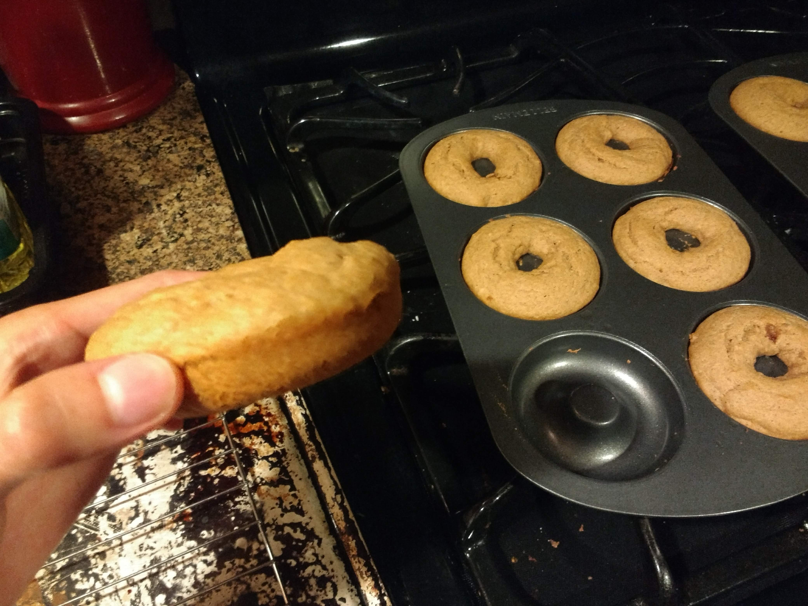
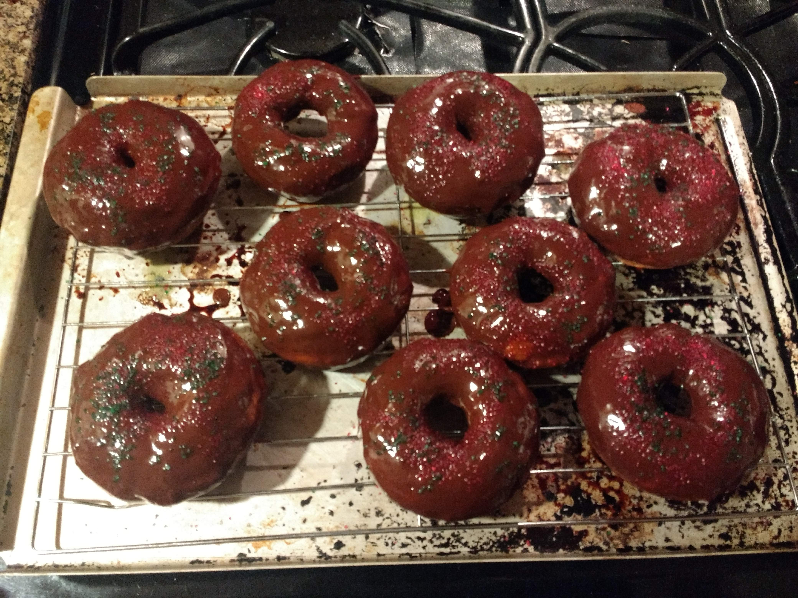

# Donuts

Source: https://lovingitvegan.com/baked-vegan-donuts/

## Results

## Notes
* This was bomb! And so easy to make, no complaints! 
* The recipe is also quite forgiving. To make things fun/seasonal, I also tried a variation where I substituted apple sauce with pumpkin puree. Honestly it didn't taste that much different, but it was a good use of leftover pumpkin. 
* The base is also versatile enough to use with any kind of topping!
