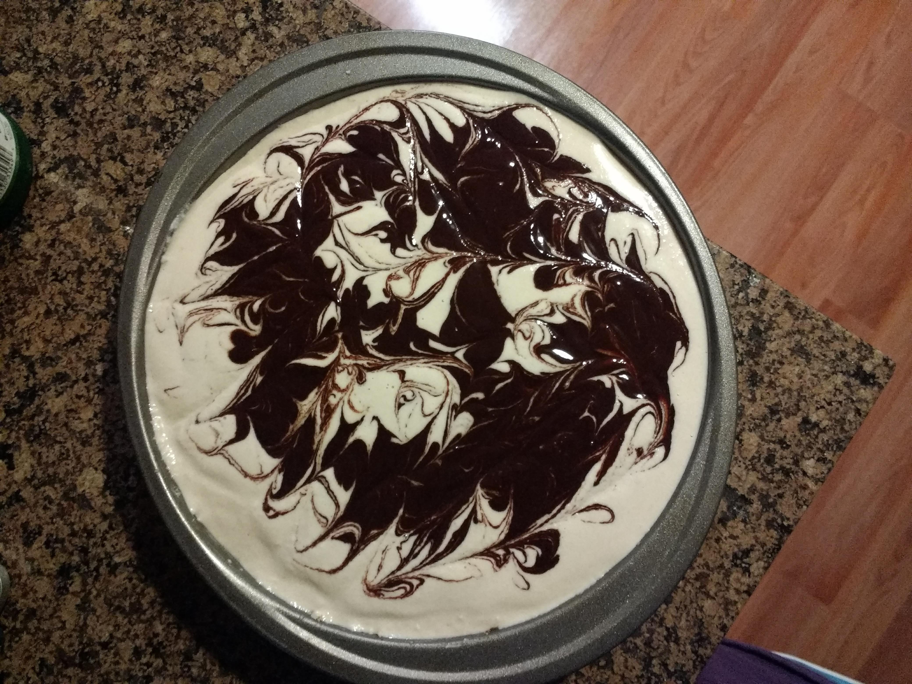
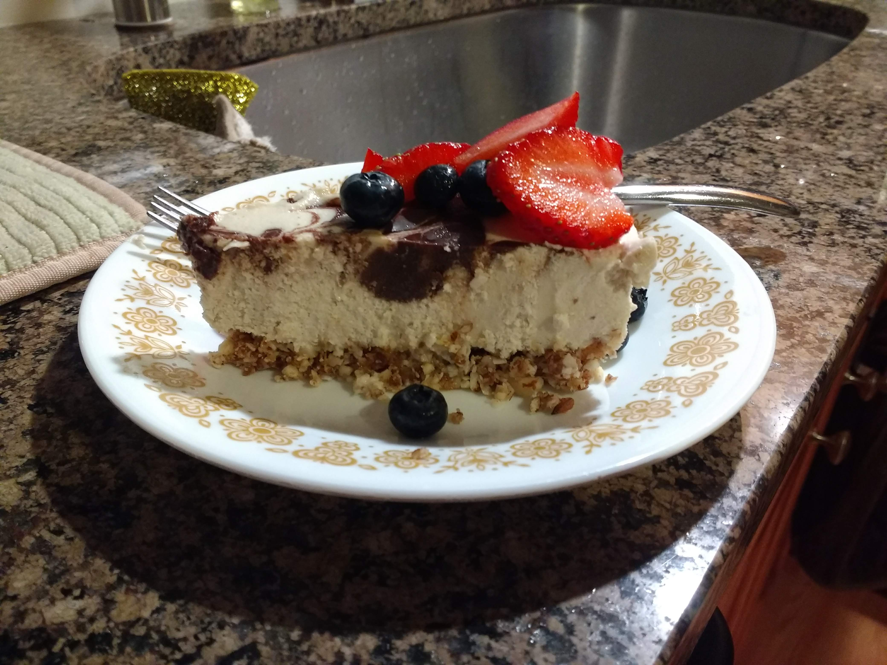

# Easy Cheesecake

This was based on 2 recipes, both by Lisa (Downshiftology):
* https://downshiftology.com/recipes/mint-chocolate-vegan-cheesecake/
* https://downshiftology.com/recipes/vegan-caramel-cheesecake/

I basically made the crust from the caramel cheesecake, and used the filling recipe of the chocolcate one, but omitting mint (I still strongly believe mint only belongs in toothpaste, and maaayyybe tea, not in my food!). 

## Results

Look at this beauty!

Slice shot:

## Notes
* 4 cups of cashews was a bit much for me, especially since I don't have a spring pan and had to use a regular (small-ish) cake pan. Probably 3 cups or even 2.5 cups would have been enough. 
* This is where I wished I had a powerful blender. Had to split the cashew cream batch in half to fit my nutribullet. It kinda worked, but it was a bit inconvenient. 
* It's so easy to mix and match different types of cheesecakes! The crust is pretty much adaptable to any kind of nut. Same with the cashew cream filling, so versatile for any kind of topping!
* Making the chocolate swirls was soooo fun! A bit of playing and voila your cake looks like it was made by a pro. 

